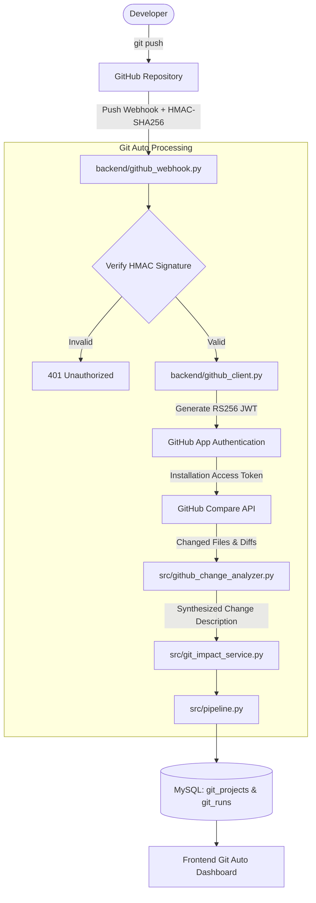
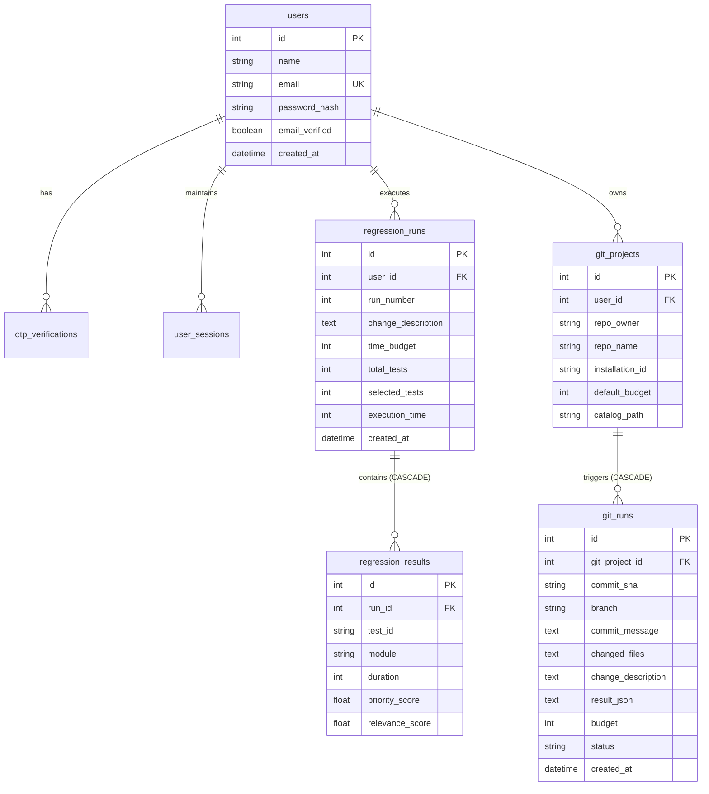

# Smart Regression Suite Optimizer

The **Smart Regression Suite Optimizer (SRSO)** is an intelligent, deterministic decision-support system that analyzes a software change and recommends an optimal subset of regression tests to execute within a fixed execution-time budget.

---

## Overview

In modern continuous delivery, software test suites grow rapidly. When a software change is introduced, running every single regression test may be impractical or impossible due to tight delivery schedules, cloud compute costs, and constrained deployment windows.

The Smart Regression Suite Optimizer addresses this challenge by evaluating each test case's:
1. **Relevance** to the incoming code modification.
2. **Business Priority** (Criticality to operations).
3. **Historical Failure Signal** (Flakiness or bug-finding track record).
4. **Execution Duration** (Execution cost in minutes).

It selects the highest-value subset of tests whose combined execution time strictly respects the specified time budget.

### Core Architectural Principle: AI Boundary

> **AI does NOT select the final regression suite.**

A foundational architectural decision in SRSO is that generative AI is restricted to semantic comprehension and qualitative explanation:
- **AI Scope:** Understanding natural-language change descriptions, matching them against test metadata (modules, descriptions, tags), and generating human-readable explanations of selection trade-offs.
- **Deterministic Scope:** Mathematical prioritization scoring, knapsack optimization, budget enforcement, coverage gap calculation, and risk debt analysis are executed entirely by deterministic algorithms.

This guarantees that identical inputs always yield identical test suites, eliminates hallucinated selections, and ensures strict mathematical compliance with testing time budgets.

---

## Problem Statement

In practical software engineering:
- A code change or pull request is introduced into a repository.
- An organization maintains a bounded regression test catalog (e.g., 20+ comprehensive regression suites).
- Each test case has distinct metadata: `test_id`, `module`, `description`, `priority`, `duration`, `tags`, and `historical_failure_count`.
- The testing window is strictly bounded (e.g., a 30-minute release window or CI slot).
- Executing all test cases would exceed the available testing window (e.g., requiring 160+ minutes).
- Testers must identify and run the most valuable tests without exceeding the budget while understanding what risks remain unaddressed.

---

## Objectives

- **Time-Constrained Selection:** Guarantee that the total duration of selected tests never exceeds the user's execution budget.
- **Deterministic Optimization:** Formulate test selection as a 0/1 Knapsack Problem, solved via Dynamic Programming.
- **AI-Assisted Relevance Matching:** Leverage LLMs (or offline keyword heuristics) to bridge plain-English change descriptions with test metadata.
- **Explainability:** Automatically explain why tests were selected or excluded in plain English.
- **Risk & Coverage Awareness:** Compute module/tag coverage, detect coverage gaps, and measure regression risk debt caused by deferred high-risk tests.
- **Autonomous Git Integration ("Git Auto"):** Automatically capture GitHub push events via webhooks, analyze changed files and diffs, and generate optimized suites for commits.
- **Enterprise-Grade Security & Auditability:** Secure user authentication (Argon2, HTTP-only cookie sessions, email OTP verification) and scoped regression run histories.

---

## Key Features

- **Test Catalog Loading & Validation:** Ingests CSV test catalogs, performing strict validation on schema, unique identifiers, positive execution durations, non-negative failure counts, and valid priority levels (`High`, `Medium`, `Low`).
- **AI-Driven Relevance Matching:** Scores the relevance ($0 - 100$) of each test case against the change description using OpenAI GPT models or an offline deterministic mock provider.
- **Deterministic Multi-Factor Scoring:** Combines relevance ($50\%$), business priority ($30\%$), and normalized historical failure rates ($20\%$) into a unified testing value score.
- **0/1 Knapsack Optimization:** Employs dynamic programming to maximize total suite value subject to $\sum \text{duration} \le \text{budget}$.
- **Exclusion & High-Risk Analysis:** Automatically isolates high-risk tests (`High` priority with relevance $\ge 50$) that could not fit into the time budget.
- **Coverage & Gap Detection:** Evaluates module coverage percentages (`Fully Covered`, `Partially Covered`, `Not Covered`), identifies uncovered modules, and tallies tag distributions.
- **Regression Risk Debt Index:** Quantifies the percentage of high-risk testing value deferred due to budget limitations and tallies additional time required.
- **AI Decision Explanations:** Explains why each test was selected or deferred based on relevance, priority, and execution duration.
- **Full User Authentication & Email OTP:** Registration with 6-digit email verification via SMTP (`aiosmtplib`), Argon2 password hashing, and database-backed HTTP-only cookie sessions.
- **User-Scoped Regression History:** Stores runs and selected test details in MySQL, featuring per-user sequential run numbering (`Run #1`, `Run #2`) and cascading deletes.
- **Git Auto (GitHub App Integration):** Webhook-driven pipeline that listens for GitHub `push` events, verifies HMAC-SHA256 signatures, queries the GitHub Compare API for file diffs, performs AI change impact analysis, and executes the optimization pipeline automatically.
- **Git Auto Run Details & Deletion:** Dedicated UI for inspecting commit metadata, changed file patches, module impacts, and deleting specific Git Auto runs with strict user ownership enforcement.

---

## System Architecture

### Standard Pipeline Flow
```mermaid
flowchart TD
    User([QA Engineer / Developer]) -->|Uploads CSV, Budget, Change Desc| Frontend[React 19 + Vite Frontend]
    Frontend -->|POST /api/optimize + Session Cookie| Backend[FastAPI Backend]
    
    subgraph Core Pipeline ["src/pipeline.py"]
        Backend --> DataLoader[data_loader.py: CSV Validation]
        DataLoader --> AIMatcher[ai_matcher.py: Semantic Relevance Matching]
        AIMatcher --> Prioritizer[prioritizer.py: Deterministic Scoring Formula]
        Prioritizer --> Optimizer[optimizer.py: 0/1 Knapsack DP]
        Optimizer --> Exclusion[exclusion_analyzer.py: High-Risk Exclusion]
        Optimizer --> Coverage[coverage_analyzer.py: Module & Tag Coverage]
        Optimizer --> RiskDebt[risk_debt_analyzer.py: Risk Debt Index]
        Optimizer --> AIExplainer[ai_explainer.py: AI Trade-Off Reasoning]
    end
    
    Core Pipeline --> DB[(MySQL Database: Runs & Results)]
    Core Pipeline --> Frontend
    Frontend --> User
```

### Git Auto Workflow


---

## Technology Stack

| Technology | Layer / Category | Why It Is Used in the Project |
| :--- | :--- | :--- |
| **React 19** | Frontend Framework | Declarative component model for rendering responsive metrics, coverage bars, test tables, and configuration modals. |
| **Vite 8** | Frontend Build Tool | Blazing-fast development server with instant HMR and optimized production bundling. |
| **Tailwind CSS v4** | UI Styling | Utility-first CSS framework for clean, modern dark/light dashboard aesthetics, cards, and responsive grids. |
| **React Router v7** | Frontend Routing | Client-side routing with route protection (`ProtectedRoute`), nested layouts (`AppLayout`), and dynamic route parameters (`/git-auto/runs/:runId`). |
| **Axios** | HTTP Client | Promise-based HTTP client configured with `withCredentials: true` for automatic HTTP-only session cookie transmission. |
| **Lucide React** | UI Icons | High-quality, consistent iconography for status indicators, metrics, and navigation. |
| **Python 3.10+** | Backend Runtime | Modern Python environment with native type hinting and robust data science / web libraries. |
| **FastAPI** | Backend Framework | High-performance asynchronous REST API framework with native Pydantic validation, dependency injection, and automatic OpenAPI documentation. |
| **Uvicorn** | ASGI Server | Lightning-fast ASGI web server implementation for hosting FastAPI. |
| **Pandas & NumPy** | Data Processing | Vectorized tabular operations for test catalog validation, DataFrame filtering, grouping, and coverage analysis. |
| **SQLAlchemy 2.0** | ORM / Persistence | Type-safe Object-Relational Mapping with declarative models, explicit foreign keys, cascading deletions, and transactional integrity. |
| **PyMySQL** | MySQL Driver | Pure-Python MySQL client connecting SQLAlchemy with the underlying relational database. |
| **Argon2-cffi** | Security & Cryptography | Winner of the Password Hashing Competition; used for hashing user passwords and email OTP tokens resistant to GPU/ASIC cracking. |
| **PyJWT & Cryptography** | GitHub Authentication | Implements RS256 private key signing to mint short-lived GitHub App JWTs and obtain installation tokens. |
| **aiosmtplib** | Asynchronous Email | Asynchronous SMTP client used to send 6-digit OTP verification codes via TLS. |
| **OpenAI Python SDK** | Artificial Intelligence | Client interface for querying GPT models (`gpt-5.6-luna`) for semantic matching and trade-off explanations. |
| **Pytest** | Automated Testing | Comprehensive testing framework used to execute the 40 automated unit, integration, and security tests. |

---

## Project Structure

```
Smart-Regression-Suite-Optimizer/
├── backend/                              # FastAPI Backend application
│   ├── api.py                            # Main FastAPI app, CORS, /api/optimize endpoint
│   ├── auth.py                           # Password hashing (Argon2) & user query helpers
│   ├── auth_routes.py                    # Routes: /register, /login, /verify-otp, /me, /logout
│   ├── database.py                       # SQLAlchemy engine, SessionLocal, get_db dependency
│   ├── git_models.py                     # SQLAlchemy models: GitProject, GitRun
│   ├── git_routes.py                     # Routes: /setup, /project, /runs, /runs/{id} (GET/DELETE)
│   ├── github_client.py                  # GitHub App JWT minting, installation tokens, Compare API
│   ├── github_webhook.py                 # POST /api/github/webhook (HMAC verification, push trigger)
│   ├── history_routes.py                 # Routes: /api/history (list runs, get single run)
│   ├── migrate_run_numbers_and_cascades.py # DB migration for per-user run numbering & cascades
│   ├── models.py                         # SQLAlchemy models: User, OTPVerification, UserSession, etc.
│   ├── otp_service.py                    # 6-digit OTP generation, hashing, and SMTP sending
│   ├── schemas.py                        # Pydantic schemas for request validation
│   └── session.py                        # Cookie-based session creation, validation, and deletion
├── data/                                 # Data catalogs and local project storage
│   ├── git_projects/                     # Uploaded catalogs for configured Git Auto repositories
│   └── test_cases.csv                    # Default bounded 20-test catalog
├── frontend/                             # React + Vite frontend application
│   ├── src/
│   │   ├── api.js                        # Axios API client functions
│   │   ├── App.jsx                       # React Router configuration & route declarations
│   │   ├── main.jsx                      # DOM mount point
│   │   ├── components/
│   │   │   ├── auth/                     # ProtectedRoute, Auth forms
│   │   │   ├── dashboard/                # StatsCards, OptimizationForm, SelectedTestsTable,
│   │   │   │                             # HighRiskTests, CoverageSection, RegressionRiskDebt, AIReasoning
│   │   │   ├── git-auto/                 # GitAutoHeader, GitAutoSetup, LatestGitRunCard,
│   │   │   │                             # GitAutoHistoryTable, GitRunDetails
│   │   │   └── layout/                   # AppLayout, Navbar, Sidebar
│   │   ├── context/
│   │   │   └── AuthContext.jsx           # Global authentication state provider
│   │   └── pages/
│   │       ├── Dashboard.jsx             # Manual regression optimization page
│   │       ├── GitAuto.jsx               # Autonomous GitHub pipeline dashboard & run inspector
│   │       ├── History.jsx               # Optimization history table & run modal
│   │       ├── InputFormat.jsx           # CSV catalog specification & interactive documentation
│   │       ├── Login.jsx                 # User login page
│   │       ├── Register.jsx              # User registration page
│   │       ├── Settings.jsx              # User profile & credentials view
│   │       └── VerifyOTP.jsx             # 6-digit email OTP verification page
│   ├── package.json                      # Frontend dependencies & scripts
│   └── vite.config.js                    # Vite configuration
├── src/                                  # Core regression optimization logic
│   ├── ai_explainer.py                   # Natural language trade-off explanation generator
│   ├── ai_matcher.py                     # Change-to-test relevance matcher (OpenAI / Mock)
│   ├── ai_provider.py                    # Provider resolver (mock vs. openai)
│   ├── coverage_analyzer.py              # Module and tag coverage calculator
│   ├── data_loader.py                    # CSV loading, type checking, and schema validation
│   ├── exclusion_analyzer.py             # Identifies high-risk excluded test cases
│   ├── git_impact_service.py             # Orchestrates change analysis + pipeline execution
│   ├── github_change_analyzer.py         # AI commit & file diff impact analyzer
│   ├── optimizer.py                      # 0/1 Knapsack Dynamic Programming optimizer
│   ├── pipeline.py                       # Main pipeline orchestration function (`run_pipeline`)
│   ├── prioritizer.py                    # Deterministic multi-factor scoring formula
│   ├── recommender.py                    # Summary and recommendation generator
│   └── risk_debt_analyzer.py             # Regression risk debt and deferred risk calculation
├── tests/                                # Automated test suite (40 tests)
│   ├── test_ai_explainer.py              # Tests for AI trade-off explanation formats
│   ├── test_ai_matcher.py                # Tests for relevance scoring (mock & empty checks)
│   ├── test_api.py                       # Tests for FastAPI endpoints & upload handling
│   ├── test_coverage_analyzer.py         # Tests for module/tag coverage calculations
│   ├── test_data_loader.py               # Tests for CSV validation rules and error raises
│   ├── test_exclusion_analyzer.py        # Tests for high-risk test exclusion criteria
│   ├── test_git_auto_fixes.py            # Comprehensive tests for Git Auto bug fixes & ownership
│   ├── test_git_impact_service.py        # Tests for Git change impact orchestration
│   ├── test_github_change_analyzer.py    # Tests for commit & diff parsing
│   ├── test_optimizer.py                 # Tests for 0/1 knapsack budget compliance & optimality
│   ├── test_pipeline.py                  # Integration tests for end-to-end pipeline
│   ├── test_prioritizer.py               # Tests for scoring formula weights and normalization
│   ├── test_recommender.py               # Tests for execution time summary & unused budget
│   ├── test_risk_debt_analyzer.py        # Tests for risk debt index and deferred module metrics
│   └── test_run_numbering_and_cascade.py # Tests for per-user run numbering & cascade deletion
├── PLAN.md                               # Architectural design and specification document
├── REQUIREMENTS.md                       # Formal functional and non-functional requirements
└── requirements.txt                      # Python backend dependencies
```

---

## Core Regression Optimization Workflow

The optimization process executed by `src/pipeline.py::run_pipeline` follows 15 precise steps:

```
[1. CSV File] ──> [2. Validation] ──> [3. Change Input] ──> [4. AI Relevance]
                                                                     │
[8. Selected Suite] <── [7. 0/1 Knapsack] <── [6. Scoring] <── [5. Prioritization]
       │
       ├──> [9. Exclusion Analysis]
       ├──> [10. Coverage Analysis]
       ├──> [11. Risk Debt Analysis]
       ├──> [12. Recommendations]
       └──> [13. AI Explanations] ──> [14. Response Payload] ──> [15. Frontend Dashboard]
```

| Step | What Happens | Why It Exists | Input | Output | Implementation |
| :--- | :--- | :--- | :--- | :--- | :--- |
| **1. Test Loading** | Loads raw CSV file from disk into a Pandas DataFrame. | Ingests the test catalog for data processing. | File path | `pd.DataFrame` | [`src/data_loader.py:load_test_cases`](file:///d:/9/Smart-Regression-Suite-Optimizer/src/data_loader.py#L19-L36) |
| **2. Validation** | Checks required columns, non-empty rows, unique `test_id`, valid priority levels (`High`, `Medium`, `Low`), positive durations, non-negative failure counts. | Prevents pipeline crashes and corrupted calculations from bad data. | `pd.DataFrame` | Validated `pd.DataFrame` | [`src/data_loader.py:load_test_cases`](file:///d:/9/Smart-Regression-Suite-Optimizer/src/data_loader.py#L38-L96) |
| **3. Change Input** | Receives the plain-English description of the software change. | Provides the functional context of the modification. | String | Stripped String | [`backend/api.py:optimize`](file:///d:/9/Smart-Regression-Suite-Optimizer/backend/api.py#L108-L115) |
| **4. Relevance Matching** | Matches change terms against test descriptions, modules, and tags. | Determines which tests have semantic relevance to the change. | DataFrame + Change Description | `dict[test_id, float]` (scores 0–100) | [`src/ai_matcher.py:calculate_relevance_scores`](file:///d:/9/Smart-Regression-Suite-Optimizer/src/ai_matcher.py#L53-L124) |
| **5. Prioritization** | Computes normalized failure scores and priority scores per test. | Synthesizes multiple engineering signals into a single ranking metric. | DataFrame + Relevance Scores | DataFrame with `priority_score` | [`src/prioritizer.py:prioritize_tests`](file:///d:/9/Smart-Regression-Suite-Optimizer/src/prioritizer.py#L58-L96) |
| **6. Score Calculation** | Applies exact weighting: $0.50 \times \text{Rel} + 0.30 \times \text{Prio} + 0.20 \times \text{Fail}$. | Balances change relevance against inherent risk and failure frequency. | Row metadata | Float (rounded to 2 decimals) | [`src/prioritizer.py:calculate_priority_score`](file:///d:/9/Smart-Regression-Suite-Optimizer/src/prioritizer.py#L23-L56) |
| **7. Optimization** | Solves 0/1 Knapsack via dynamic programming with capacity = `time_budget`. | Maximizes testing value without exceeding time limits. | Prioritized DataFrame + Budget | Filtered DataFrame (`selected=True`) | [`src/optimizer.py:optimize_regression_suite`](file:///d:/9/Smart-Regression-Suite-Optimizer/src/optimizer.py#L4-L60) |
| **8. Suite Selection** | Extracts selected test subset sorted by execution sequence. | Final set of tests designated for execution. | Selected DataFrame | Selected Test Rows | [`src/optimizer.py:optimize_regression_suite`](file:///d:/9/Smart-Regression-Suite-Optimizer/src/optimizer.py#L54-L60) |
| **9. Exclusion Analysis** | Filters tests not selected where `priority == "High"` and `relevance_score >= 50`. | Warns QA engineers about critical tests deferred due to budget limits. | All Tests + Selected Tests | `list[dict]` (High-risk exclusions) | [`src/exclusion_analyzer.py:analyze_exclusions`](file:///d:/9/Smart-Regression-Suite-Optimizer/src/exclusion_analyzer.py#L7-L48) |
| **10. Coverage Analysis** | Computes module coverage rates, uncovered modules, and tag frequencies. | Reveals testing blind spots across system modules. | All Tests + Selected Tests | Coverage metrics dictionary | [`src/coverage_analyzer.py:analyze_coverage`](file:///d:/9/Smart-Regression-Suite-Optimizer/src/coverage_analyzer.py#L4-L132) |
| **11. Risk Debt Analysis** | Measures the percentage of relevant high-risk score unexecuted. | Translates exclusions into an actionable "Risk Debt Index". | Excluded Tests + Prioritized Tests | Risk debt metrics dictionary | [`src/risk_debt_analyzer.py:calculate_risk_debt`](file:///d:/9/Smart-Regression-Suite-Optimizer/src/risk_debt_analyzer.py#L4-L143) |
| **12. Recommendations** | Generates summary metrics (unused budget, highest covered module). | Informs user whether budget was fully utilized or has slack. | Selected Tests + Coverage + Budget | Recommendations dictionary | [`src/recommender.py:generate_recommendation`](file:///d:/9/Smart-Regression-Suite-Optimizer/src/recommender.py#L4-L60) |
| **13. AI Explanations** | Prompts LLM (or mock) to generate trade-off reasoning in plain English. | Provides transparent auditability for human evaluators. | Selected + Excluded + Change + Budget | Explanations dictionary | [`src/ai_explainer.py:generate_ai_explanations`](file:///d:/9/Smart-Regression-Suite-Optimizer/src/ai_explainer.py#L41-L121) |
| **14. Backend Response** | Persists run & results to DB and returns JSON payload to client. | Records historical execution and provides API contract. | Pipeline outputs | Structured JSON response | [`backend/api.py:optimize`](file:///d:/9/Smart-Regression-Suite-Optimizer/backend/api.py#L190-L261) |
| **15. Frontend View** | Renders stat cards, test tables, coverage progress bars, and risk alerts. | Provides an interactive dashboard for the QA engineer. | JSON response | Interactive UI view | [`frontend/src/pages/Dashboard.jsx`](file:///d:/9/Smart-Regression-Suite-Optimizer/frontend/src/pages/Dashboard.jsx) |

---

## Prioritization Algorithm

The deterministic scoring algorithm assigns every candidate test case a `priority_score` between $0$ and $100$.

### Exact Mathematical Formula

$$\text{Final Priority Score} = (\text{Relevance Score} \times 0.50) + (\text{Business Priority Score} \times 0.30) + (\text{Historical Failure Score} \times 0.20)$$

#### 1. Business Priority Weights
Confirmed in [`src/prioritizer.py`](file:///d:/9/Smart-Regression-Suite-Optimizer/src/prioritizer.py#L4-L8):
```python
PRIORITY_SCORES = {
    "High": 100,
    "Medium": 60,
    "Low": 30,
}
```

#### 2. Historical Failure Normalization
Confirmed in [`src/prioritizer.py`](file:///d:/9/Smart-Regression-Suite-Optimizer/src/prioritizer.py#L11-L20):
$$\text{Historical Failure Score} = \begin{cases} 
\left(\frac{\text{failure\_count}}{\text{max\_failure\_count}}\right) \times 100 & \text{if } \text{max\_failure\_count} > 0 \\ 
0.0 & \text{otherwise} 
\end{cases}$$

#### 3. Why Duration is a Constraint, Not a Score Component
A common anti-pattern is dividing priority by duration or subtracting duration from score. In SRSO, **duration represents resource cost (knapsack weight)**, while priority score represents **value**. Treating duration as a constraint rather than a penalty prevents the system from unfairly favoring trivial 1-minute tests over comprehensive, critical 10-minute tests.

---

## Optimization Algorithm

Regression suite selection is formally modeled as the **0/1 Knapsack Problem**, a classic NP-complete combinatorial optimization problem.

### Problem Mapping

| Knapsack Concept | Regression Optimization Equivalent |
| :--- | :--- |
| **Items ($i$)** | Test cases ($TC001, TC002, \dots, TC020$) |
| **Value ($v_i$)** | Test `priority_score` (computed deterministically) |
| **Weight / Cost ($w_i$)** | Test `duration` (in minutes) |
| **Capacity ($W$)** | `time_budget` (available testing window in minutes) |
| **Decision Variable ($x_i$)** | Binary: $x_i \in \{0, 1\}$ ($1$ = Selected, $0$ = Excluded) |

### Formal Objective
$$\max \sum_{i=1}^{N} x_i \cdot \text{priority\_score}_i \quad \text{subject to} \quad \sum_{i=1}^{N} x_i \cdot \text{duration}_i \le \text{time\_budget}$$

### Implementation Details
Implemented in [`src/optimizer.py::optimize_regression_suite`](file:///d:/9/Smart-Regression-Suite-Optimizer/src/optimizer.py#L4-L60):
- **Dynamic Programming Table:** Uses a 1-dimensional array `dp` of size `time_budget + 1`, where `dp[t]` holds the maximum achievable priority score for testing time $t$.
- **Backwards Iteration:** The inner loop runs backwards from `time_budget` down to `duration`, ensuring each test case is included at most once (0/1 constraint).
- **Index Tracking:** A parallel array `selected[t]` stores the list of test indices used to achieve `dp[t]`.
- **Complexity:**
  - **Time Complexity:** $\mathcal{O}(N \times B)$, where $N$ is the number of test cases (e.g., 20) and $B$ is the time budget (e.g., 30). For $N=20, B=30$, operations are under $1,000$ iterations, executing in $< 2$ milliseconds.
  - **Space Complexity:** $\mathcal{O}(B \times N)$ to store the DP table and selected index lists.

---

## AI Architecture

The boundary between AI and deterministic logic is strictly enforced:

```
┌────────────────────────────────────────────────────────┐
│                   AI BOUNDARY                          │
│                                                        │
│  [Natural Language Change]                             │
│             │                                          │
│             ▼                                          │
│  src/ai_matcher.py (OpenAI / Mock Heuristic)           │
│  Output: relevance_scores {TC001: 75.0, TC002: 100.0}   │
└──────────────────────────┬─────────────────────────────┘
                           │
                           ▼
┌────────────────────────────────────────────────────────┐
│               DETERMINISTIC BOUNDARY                   │
│                                                        │
│  1. prioritizer.py: Score = 0.5*Rel + 0.3*Prio + 0.2*F │
│  2. optimizer.py: 0/1 Knapsack DP (Budget Bound)       │
│  3. coverage_analyzer.py: Module/Tag Percentages       │
│  4. exclusion_analyzer.py: High-Risk Exclusion Logic   │
│  5. risk_debt_analyzer.py: Risk Debt Index Calculation │
└──────────────────────────┬─────────────────────────────┘
                           │
                           ▼
┌────────────────────────────────────────────────────────┐
│                   AI BOUNDARY                          │
│                                                        │
│  src/ai_explainer.py (OpenAI / Mock Heuristic)         │
│  Input: Selected & Excluded tests + Budget             │
│  Output: Natural language explanations of trade-offs   │
└────────────────────────────────────────────────────────┘
```

### Mock AI Provider Fallback
When `AI_PROVIDER=mock` (or when OpenAI is unconfigured/offline):
- [`src/ai_matcher.py`](file:///d:/9/Smart-Regression-Suite-Optimizer/src/ai_matcher.py#L8-L50) computes relevance using word-overlap heuristics against test metadata:
  - $\ge 3$ keyword matches $\to 100.0$
  - $2$ keyword matches $\to 75.0$
  - $1$ keyword match $\to 50.0$
  - $0$ keyword matches $\to 0.0$
- [`src/ai_explainer.py`](file:///d:/9/Smart-Regression-Suite-Optimizer/src/ai_explainer.py#L8-L38) generates structured rule-based trade-off explanations.
- This ensures 100% of the platform's functionality and tests operate seamlessly offline without external API keys.

---

## Git Auto

**Git Auto** provides autonomous regression testing triggered directly by Git version control events.

### End-to-End Lifecycle
1. **GitHub Push Event:** A developer runs `git push origin feature-branch`.
2. **Webhook Receipt:** GitHub delivers a POST request to `/api/github/webhook` with the `X-Hub-Signature-256` header.
3. **Signature Verification:** The backend verifies the HMAC-SHA256 signature using `GITHUB_WEBHOOK_SECRET`.
4. **Project Lookup:** Resolves the `GitProject` record matching `repo_owner`, `repo_name`, and `installation_id`.
5. **Compare API Invocation:** The backend mints a short-lived RS256 JWT, requests an installation token, and queries GitHub's Compare API (`/repos/{owner}/{repo}/compare/{before}...{after}`).
6. **Change Analysis:** [`src/github_change_analyzer.py`](file:///d:/9/Smart-Regression-Suite-Optimizer/src/github_change_analyzer.py#L71-L165) extracts changed file names, patch diffs, and commit messages to deduce affected modules, features, and risk areas.
7. **Pipeline Execution:** Synthesized change summaries are fed into `run_git_impact`, which executes the optimization pipeline against the repository's uploaded test catalog and default budget.
8. **Persistence:** Results are stored in the `git_runs` table (`status="completed"` or `"failed"`).
9. **UI Inspection & Deletion:** Developers inspect commit changes, affected modules, selected tests, and risk debt in the Git Auto dashboard, with the ability to delete individual runs securely.

---

## GitHub Integration

The GitHub integration connects directly to the GitHub REST API using GitHub App credentials:

- **App Authentication (`RS256`):** Handled in [`backend/github_client.py`](file:///d:/9/Smart-Regression-Suite-Optimizer/backend/github_client.py#L11-L40). Generates an asymmetric RSA JWT signed by the App's private `.pem` key.
- **Installation Access Token:** Uses the JWT to request an ephemeral installation token via `POST https://api.github.com/app/installations/{installation_id}/access_tokens`.
- **Compare API:** Queries `GET https://api.github.com/repos/{owner}/{repo}/compare/{before}...{after}` to obtain the list of changed files, commit count, and line diffs (`patch`).
- **Webhook Security:** Webhook payloads are verified in [`backend/github_webhook.py`](file:///d:/9/Smart-Regression-Suite-Optimizer/backend/github_webhook.py#L28-L52) using `hmac.compare_digest` against `sha256=<hex_digest>`.

---

## Backend API

### Endpoint Summary Table

| Method | Endpoint | Purpose | Authentication |
| :--- | :--- | :--- | :--- |
| `GET` | `/` | Root service status message | Public |
| `GET` | `/health` | API health check endpoint | Public |
| `POST` | `/api/auth/register` | Register new user & send email OTP | Public |
| `POST` | `/api/auth/verify-otp` | Verify 6-digit email OTP | Public |
| `POST` | `/api/auth/resend-otp` | Invalidate previous OTP & resend new code | Public |
| `POST` | `/api/auth/login` | Authenticate user & issue session cookie | Public |
| `GET` | `/api/auth/me` | Fetch currently authenticated user | Session Cookie |
| `POST` | `/api/auth/logout` | Destroy session in DB & clear cookie | Session Cookie |
| `POST` | `/api/optimize` | Run regression optimization pipeline | Session Cookie |
| `GET` | `/api/history` | List user's historical regression runs | Session Cookie |
| `GET` | `/api/history/{run_id}` | Fetch details & selected tests for a run | Session Cookie |
| `POST` | `/api/github/webhook` | Ingest GitHub push events | HMAC-SHA256 Header |
| `POST` | `/api/git-impact/setup` | Register/update a Git Auto repository | Session Cookie |
| `GET` | `/api/git-impact/project` | Fetch user's configured Git Auto project | Session Cookie |
| `GET` | `/api/git-impact/runs` | List user's Git Auto runs | Session Cookie |
| `GET` | `/api/git-impact/runs/{run_id}` | Fetch detailed Git Auto run results | Session Cookie |
| `DELETE` | `/api/git-impact/runs/{run_id}` | Delete a specific Git Auto run | Session Cookie |

---

## Database Design

Implemented with SQLAlchemy 2.0 and MySQL.



### Cascade Deletions & Referential Integrity
- `regression_runs.user_id` $\to$ `users.id` with `ON DELETE CASCADE`.
- `regression_results.run_id` $\to$ `regression_runs.id` with `ON DELETE CASCADE`.
- `git_projects.user_id` $\to$ `users.id` with `ON DELETE CASCADE`.
- `git_runs.git_project_id` $\to$ `git_projects.id` with `ON DELETE CASCADE`.
- Deleting an account or a project automatically cleans up all associated runs and results, preventing orphaned rows.

---

## Authentication and Security

- **Argon2 Password Hashing:** Uses `argon2-cffi` with salt and memory-hard parameters for user passwords and stored OTP hashes.
- **Stateful Database Sessions:** Authentication uses a 32-byte cryptographically secure random token (`secrets.token_urlsafe(32)`). Only the SHA-256 hash of the token is persisted in `user_sessions`.
- **HTTP-Only Cookies:** Session tokens are delivered via an HTTP-only cookie (`srso_session`, `SameSite=Lax`, 7-day expiration). Javascript cannot access the raw cookie, preventing XSS-based session theft.
- **OTP Verification:** 6-digit random codes (`secrets.randbelow(1_000_000)`), valid for 10 minutes with a 5-attempt brute-force limit.
- **Ownership Scoping:** All API endpoints (`/api/history/{id}`, `/api/git-impact/runs/{id}`, DELETE routes) explicitly verify that requested resources belong to the requesting user's ID.
- **Webhook Integrity:** Inbound GitHub webhooks require valid `X-Hub-Signature-256` matching the SHA-256 HMAC of the request body.

---

## Frontend Architecture

The frontend is a single-page application built with React 19, Vite, and Tailwind CSS.

### Pages and Views
- [`Login.jsx`](file:///d:/9/Smart-Regression-Suite-Optimizer/frontend/src/pages/Login.jsx) & [`Register.jsx`](file:///d:/9/Smart-Regression-Suite-Optimizer/frontend/src/pages/Register.jsx): Email and password authentication with client-side validation.
- [`VerifyOTP.jsx`](file:///d:/9/Smart-Regression-Suite-Optimizer/frontend/src/pages/VerifyOTP.jsx): 6-digit code entry interface with resend countdown timer.
- [`Dashboard.jsx`](file:///d:/9/Smart-Regression-Suite-Optimizer/frontend/src/pages/Dashboard.jsx): Core optimizer interface containing:
  - `StatsCards`: Displays total tests, selected count, execution time, and budget utilization.
  - `OptimizationForm`: File uploader, change description textarea, and budget input.
  - `SelectedTestsTable`: Detailed table of recommended tests with duration, priority badges, and scores.
  - `HighRiskTests`: Alert table of high-risk tests excluded by budget constraints.
  - `CoverageSection`: Visual progress bars for module coverage and tag distribution pills.
  - `RegressionRiskDebt`: Risk debt index gauge, deferred execution time, and affected modules.
  - `AIReasoning`: Expandable cards explaining selection and exclusion rationales.
- [`GitAuto.jsx`](file:///d:/9/Smart-Regression-Suite-Optimizer/frontend/src/pages/GitAuto.jsx): Repository configuration, run history, and detailed commit inspection.
- [`History.jsx`](file:///d:/9/Smart-Regression-Suite-Optimizer/frontend/src/pages/History.jsx): Tabular listing of previous runs with modal inspection.
- [`InputFormat.jsx`](file:///d:/9/Smart-Regression-Suite-Optimizer/frontend/src/pages/InputFormat.jsx): Live interactive documentation of required CSV columns and format rules.
- [`Settings.jsx`](file:///d:/9/Smart-Regression-Suite-Optimizer/frontend/src/pages/Settings.jsx): User account details and configuration summaries.

---

## Test Case Data Format

The test catalog must be provided as a CSV file with the following required columns:

| Column Name | Type | Description | Validation Rule |
| :--- | :--- | :--- | :--- |
| `test_id` | String | Unique test identifier | Must be unique across all rows |
| `module` | String | System functional module | Non-empty string |
| `description` | String | Plain-English test scenario | Non-empty string |
| `priority` | String | Business priority level | Must be exactly `High`, `Medium`, or `Low` |
| `duration` | Integer | Execution duration in minutes | Must be a strictly positive integer ($> 0$) |
| `tags` | String | Comma-delimited descriptive tags | Non-empty string (e.g., `"payment,upi"`) |
| `historical_failure_count` | Integer | Historical test failure frequency | Must be a non-negative integer ($\ge 0$) |

### Example CSV (`data/test_cases.csv`)
```csv
test_id,module,description,priority,duration,tags,historical_failure_count
TC001,Authentication,Verify login with valid credentials,High,5,"authentication,login,success",4
TC002,Authentication,Verify login with invalid password,High,6,"authentication,login,failure",7
TC003,Authentication,Verify account lockout after failed attempts,High,8,"authentication,lockout,security",9
TC004,Authentication,Verify password reset using registered email,Medium,10,"authentication,password-reset,email",3
TC013,Payment,Verify successful UPI payment,High,8,"payment,upi,success",10
TC014,Payment,Verify failed UPI payment,High,7,"payment,upi,failure",12
TC015,Payment,Verify UPI payment timeout handling,High,15,"payment,upi,timeout",9
TC016,Payment,Verify card payment processing,High,10,"payment,card",5
TC017,Payment,Verify payment refund processing,High,14,"payment,refund",11
```

---

## Main API Request Example

### Optimization Request
```bash
curl -X POST "http://localhost:8000/api/optimize" \
  -b "srso_session=<YOUR_SESSION_TOKEN>" \
  -F "file=@data/test_cases.csv" \
  -F "change_description=Updated UPI payment gateway and checkout timeout handling" \
  -F "time_budget=30"
```

### Expected Response Structure
```json
{
  "run_id": 42,
  "run_number": 3,
  "summary": {
    "total_tests": 20,
    "selected_count": 4,
    "excluded_high_risk_count": 1,
    "other_excluded_count": 15
  },
  "selected_tests": [
    {
      "test_id": "TC014",
      "module": "Payment",
      "duration": 7,
      "priority": "High",
      "priority_score": 94.0,
      "relevance_score": 100.0,
      "selected": true
    },
    {
      "test_id": "TC013",
      "module": "Payment",
      "duration": 8,
      "priority": "High",
      "priority_score": 90.67,
      "relevance_score": 100.0,
      "selected": true
    },
    {
      "test_id": "TC015",
      "module": "Payment",
      "duration": 15,
      "priority": "High",
      "priority_score": 89.0,
      "relevance_score": 100.0,
      "selected": true
    }
  ],
  "excluded_high_risk_tests": [
    {
      "test_id": "TC017",
      "module": "Payment",
      "priority": "High",
      "duration": 14,
      "relevance_score": 75.0,
      "historical_failure_count": 11
    }
  ],
  "coverage": {
    "total_tests": 20,
    "total_selected_tests": 3,
    "module_coverage": {
      "Payment": {
        "total_tests": 5,
        "selected_tests": 3,
        "coverage_percentage": 60.0,
        "status": "Partially Covered"
      }
    },
    "uncovered_modules": ["Authentication", "Cart", "Orders", "Search"]
  },
  "recommendation": {
    "total_selected_tests": 3,
    "total_execution_time": 30,
    "time_budget": 30,
    "remaining_time": 0,
    "recommendations": [
      "Payment has the highest selected-test coverage.",
      "The available execution budget is fully used."
    ]
  },
  "risk_debt": {
    "has_debt": true,
    "high_risk_excluded": 1,
    "risk_debt_index": 21.4,
    "deferred_time": 14,
    "deferred_modules": ["Payment"]
  },
  "ai_explanations": {
    "selected_reasons": {
      "TC014": "TC014 was selected because it is relevant to the change and has a High priority with a 7-minute execution time."
    },
    "excluded_reasons": {
      "TC017": "TC017 is a high-risk test, but it was excluded because the available execution budget limited the regression suite."
    },
    "overall_tradeoff": "The selected suite balances test relevance, priority, historical failure risk, and the available execution-time budget."
  }
}
```

---

## Installation

### 1. Clone the Repository
```bash
git clone https://github.com/Rakshithh-K/Smart-Regression-Suite-Optimizer.git
cd Smart-Regression-Suite-Optimizer
```

### 2. Backend Setup
**Prerequisites:** Python 3.10 or higher, MySQL server.

```bash
# Create and activate virtual environment
python -m venv .venv
# On Windows PowerShell:
.venv\Scripts\Activate.ps1
# On Linux / macOS:
source .venv/bin/activate

# Install dependencies
pip install -r requirements.txt
```

### 3. Frontend Setup
**Prerequisites:** Node.js 18+ and npm.

```bash
cd frontend
npm install
cd ..
```

---

## Environment Variables

Create a `.env` file in the repository root directory:

| Variable | Purpose | Required | Default / Example |
| :--- | :--- | :---: | :--- |
| `AI_PROVIDER` | AI backend provider mode (`mock` or `openai`) | No | `mock` |
| `OPENAI_API_KEY` | OpenAI API key for semantic matching | Only if `AI_PROVIDER=openai` | `sk-...` |
| `MYSQL_HOST` | MySQL database hostname | No | `localhost` |
| `MYSQL_PORT` | MySQL database port | No | `3306` |
| `MYSQL_USER` | MySQL database user | No | `root` |
| `MYSQL_PASSWORD` | MySQL database password | Yes | `your_mysql_password` |
| `MYSQL_DATABASE` | MySQL database schema name | No | `srso` |
| `SMTP_HOST` | SMTP server for OTP emails | No | `smtp.gmail.com` |
| `SMTP_PORT` | SMTP port | No | `587` |
| `SMTP_USER` | SMTP email address | Yes (for OTP) | `your_email@gmail.com` |
| `SMTP_PASSWORD` | SMTP app-specific password | Yes (for OTP) | `your_app_password` |
| `GITHUB_APP_ID` | GitHub App ID for Git Auto | Yes (for Git Auto) | `123456` |
| `GITHUB_PRIVATE_KEY_PATH`| Path to GitHub App `.pem` private key | Yes (for Git Auto) | `backend/secrets/app.pem` |
| `GITHUB_WEBHOOK_SECRET` | Secret for HMAC webhook verification | Yes (for Git Auto) | `your_webhook_secret` |

---

## Running the Project

### 1. Database Setup & Migrations
Ensure MySQL is running with database `srso` created:
```sql
CREATE DATABASE IF NOT EXISTS srso;
```
Run the migration script to apply per-user run numbering and cascade foreign keys:
```bash
python -m backend.migrate_run_numbers_and_cascades
```

### 2. Start the Backend Server
```bash
uvicorn backend.api:app --reload --host 127.0.0.1 --port 8000
```
API Documentation will be available at: `http://127.0.0.1:8000/docs`

### 3. Start the Frontend Server
In a separate terminal:
```bash
cd frontend
npm run dev
```
Access the application at: `http://localhost:5173`

---

## Testing

The project includes 40 comprehensive automated tests covering unit logic, integration pipelines, API endpoints, algorithms, and security boundaries.

### Test Execution Command
Run the test suite from the repository root:
```bash
python -m pytest -v
```

### Test Suite Structure (40 Passing Tests)
- [`tests/test_data_loader.py`](file:///d:/9/Smart-Regression-Suite-Optimizer/tests/test_data_loader.py): Verifies CSV validation, duplicate ID detection, and error handling for missing/invalid columns.
- [`tests/test_prioritizer.py`](file:///d:/9/Smart-Regression-Suite-Optimizer/tests/test_prioritizer.py): Validates exact formula weights ($0.50 / 0.30 / 0.20$), priority scoring values, and failure rate normalization.
- [`tests/test_optimizer.py`](file:///d:/9/Smart-Regression-Suite-Optimizer/tests/test_optimizer.py): Validates 0/1 knapsack compliance with budget limits, optimal subset selection, and invalid budget handling.
- [`tests/test_coverage_analyzer.py`](file:///d:/9/Smart-Regression-Suite-Optimizer/tests/test_coverage_analyzer.py): Tests module status assignment (`Fully Covered`, `Partially Covered`, `Not Covered`) and tag aggregation.
- [`tests/test_exclusion_analyzer.py`](file:///d:/9/Smart-Regression-Suite-Optimizer/tests/test_exclusion_analyzer.py): Tests high-risk exclusion criteria (`High` priority + relevance $\ge 50$).
- [`tests/test_risk_debt_analyzer.py`](file:///d:/9/Smart-Regression-Suite-Optimizer/tests/test_risk_debt_analyzer.py): Confirms Risk Debt Index calculations and deferred execution time sums.
- [`tests/test_recommender.py`](file:///d:/9/Smart-Regression-Suite-Optimizer/tests/test_recommender.py): Tests budget surplus calculation and module coverage summary strings.
- [`tests/test_ai_matcher.py`](file:///d:/9/Smart-Regression-Suite-Optimizer/tests/test_ai_matcher.py) & [`tests/test_ai_explainer.py`](file:///d:/9/Smart-Regression-Suite-Optimizer/tests/test_ai_explainer.py): Tests mock AI scoring rules and explanation structures.
- [`tests/test_github_change_analyzer.py`](file:///d:/9/Smart-Regression-Suite-Optimizer/tests/test_github_change_analyzer.py) & [`tests/test_git_impact_service.py`](file:///d:/9/Smart-Regression-Suite-Optimizer/tests/test_git_impact_service.py): Verifies commit message parsing and Git impact pipeline orchestration.
- [`tests/test_api.py`](file:///d:/9/Smart-Regression-Suite-Optimizer/tests/test_api.py): Tests FastAPI upload endpoints, validation errors, and health routes.
- [`tests/test_run_numbering_and_cascade.py`](file:///d:/9/Smart-Regression-Suite-Optimizer/tests/test_run_numbering_and_cascade.py): Tests per-user sequential run numbering (`Run #1`, `Run #2`) and cascade deletion of regression runs and results on user deletion.
- [`tests/test_git_auto_fixes.py`](file:///d:/9/Smart-Regression-Suite-Optimizer/tests/test_git_auto_fixes.py): 10 dedicated security and regression tests verifying:
  - Multi-project run lookups.
  - Cross-user run access protection (404 on foreign runs).
  - Setup de-duplication (updating existing projects).
  - Safe handling of failed and legacy runs with missing `result_json`.
  - Scoped run deletion without affecting other runs or projects.

---

## Important Bugs and Engineering Fixes

During the development and testing of SRSO, several non-trivial engineering bugs were isolated, fixed, and verified:

### 1. Global DB Auto-Increment Leak in Run Numbers
- **Problem:** When a new user registered and executed their first regression run, the UI displayed `Run #17` instead of `Run #1` because the database table's global primary key was being exposed.
- **Root Cause:** The `regression_runs` table lacked a per-user sequential counter.
- **Fix:** Added a `run_number` column to `RegressionRun`. In `backend/api.py`, the run number is computed as `(last_run.run_number + 1) if last_run else 1` scoped strictly to `user_id`.
- **Verification:** Verified by [`tests/test_run_numbering_and_cascade.py`](file:///d:/9/Smart-Regression-Suite-Optimizer/tests/test_run_numbering_and_cascade.py).

### 2. Multi-Project Run Lookup 404 Bug in Git Auto
- **Problem:** Users who configured more than one Git Auto repository received a `404 Not Found` when attempting to view runs belonging to their second repository.
- **Root Cause:** In `backend/git_routes.py`, `get_git_run` called `db.query(GitProject).filter(GitProject.user_id == current_user.id).first()`, which retrieved only the user's *first* project. If a run belonged to the user's *second* project, the validation check rejected it.
- **Fix:** Refactored queries to fetch all project IDs owned by the user (`projects = db.query(GitProject).filter(GitProject.user_id == current_user.id).all()`) and validated using `GitRun.git_project_id.in_(project_ids)`.
- **Verification:** Verified in [`tests/test_git_auto_fixes.py::test_user_with_multiple_git_projects_can_open_run`](file:///d:/9/Smart-Regression-Suite-Optimizer/tests/test_git_auto_fixes.py#L31-L85).

### 3. Duplicate GitProject Records on Repository Reconfiguration
- **Problem:** Re-submitting the Git Auto setup form for an existing repository inserted duplicate project records in MySQL, leading to ambiguous webhook routing.
- **Root Cause:** `setup_git_project` lacked an upsert check for `(user_id, repo_owner, repo_name)`.
- **Fix:** Added a check for existing projects. If found, existing fields (`installation_id`, `default_budget`, `catalog_path`) are updated in-place rather than inserting a new row.
- **Verification:** Verified in [`tests/test_git_auto_fixes.py::test_setup_updates_existing_project_instead_of_duplicates`](file:///d:/9/Smart-Regression-Suite-Optimizer/tests/test_git_auto_fixes.py#L129-L193).

### 4. Application Crash on Legacy or Failed Git Runs with Missing Result JSON
- **Problem:** Opening a failed Git Auto run or legacy record with `result_json = None` caused a 500 server error and crashed the frontend view.
- **Root Cause:** Unconditional call to `json.loads(run.result_json)`.
- **Fix:** Guarded deserialization with fallback defaults: `json.loads(run.result_json or "{}")`. Updated the frontend `GitRunDetails` component to display failure alerts gracefully.
- **Verification:** Verified in [`tests/test_git_auto_fixes.py::test_failed_git_run_can_be_displayed_without_optimization_result`](file:///d:/9/Smart-Regression-Suite-Optimizer/tests/test_git_auto_fixes.py#L195-L235).

### 5. Git Auto Run Deletion Scoping
- **Problem:** Deleting a Git Auto run needed to ensure that users could not delete runs belonging to other users, and that deleting a run did not cascade to delete other runs or the parent project.
- **Root Cause:** Deletion endpoint needed strict multi-project ownership verification.
- **Fix:** Implemented `DELETE /api/git-impact/runs/{run_id}` requiring `GitRun.git_project_id.in_(project_ids)` where `project_ids` belong to `current_user.id`.
- **Verification:** Verified in [`tests/test_git_auto_fixes.py::test_authenticated_user_can_delete_own_run`](file:///d:/9/Smart-Regression-Suite-Optimizer/tests/test_git_auto_fixes.py#L280-L322) and `test_user_cannot_delete_another_users_run`.

---

## Error Handling

| Scenario | HTTP Status | Response / Behavior |
| :--- | :---: | :--- |
| **Missing required CSV columns** | `400 Bad Request` | `{"detail": "Missing required columns: ['module', 'duration']"}` |
| **Invalid priority value in CSV** | `400 Bad Request` | `{"detail": "Invalid priority values: {'Urgent'}"}` |
| **Non-positive duration in CSV** | `400 Bad Request` | `{"detail": "Duration must be greater than zero."}` |
| **Time budget $\le 0$** | `400 Bad Request` | `{"detail": "Time budget must be greater than 0."}` |
| **Unauthenticated request** | `401 Unauthorized` | `{"detail": "Not authenticated."}` |
| **Accessing another user's run** | `404 Not Found` | `{"detail": "Git Impact run not found."}` (Prevents ID enumeration) |
| **Invalid webhook signature** | `401 Unauthorized` | `{"detail": "Invalid GitHub webhook signature."}` |
| **Unconfigured repository webhook**| `404 Not Found` | `{"detail": "No Git Impact project is configured for this repository."}` |
| **AI Provider failure** | Graceful fallback | Transparently falls back to local deterministic mock matching without failing. |

---

## End-to-End Example

### Scenario
**Code Change:** `"Updated payment processing and checkout validation."`  
**Execution Budget:** `30 minutes`  
**Catalog:** 20 test cases total (total duration = 162 minutes).

### Step-by-Step Flow:
1. **Semantic Matching:**
   - Tests tagged with `"payment"`, `"upi"`, `"checkout"` (such as `TC013`, `TC014`, `TC015`, `TC016`, `TC017`) match keywords and receive high relevance scores ($75 - 100$).
   - Tests for unrelated modules (e.g., `TC020` Search, `TC006` Cart) receive lower relevance scores ($0 - 50$).
2. **Prioritization Scoring:**
   - `TC014` (Payment Failure, `High` priority = 100, 12 historical failures = maximum in catalog):
     $$\text{Score} = (100 \times 0.50) + (100 \times 0.30) + (100 \times 0.20) = 50 + 30 + 20 = 100.0$$
   - `TC013` (Payment Success, `High` priority = 100, 10 historical failures):
     $$\text{Score} = (100 \times 0.50) + (100 \times 0.30) + (83.3 \times 0.20) = 50 + 30 + 16.67 = 96.67$$
3. **0/1 Knapsack Optimization:**
   - With a 30-minute budget, the optimizer evaluates test combinations.
   - It selects `TC014` (7 min), `TC013` (8 min), and `TC015` (15 min).
   - Total selected duration: $7 + 8 + 15 = 30\text{ minutes}$ (100% budget utilization).
4. **Exclusion & Risk Debt Analysis:**
   - `TC017` (Payment Refund, duration = 14 min, `High` priority, relevance = 75) could not fit without exceeding the 30-minute budget.
   - Identified as an **Excluded High-Risk Test**.
   - **Risk Debt Index:** $\approx 21.4\%$, with 14 minutes of deferred high-risk execution time flagged to the engineer.
5. **Coverage:**
   - Module `Payment` is marked as **Partially Covered** (60%).
   - Modules `Authentication`, `Cart`, `Orders`, and `Search` are flagged as **Uncovered Modules**.
6. **AI Explanation Generated:**
   > *"TC014 and TC013 were selected due to direct relevance to payment processing changes and high historical failure signals. TC017 was deferred because its 14-minute execution duration exceeded the remaining budget."*

---

## Design Decisions and Trade-offs

1. **Why React + FastAPI?**
   - FastAPI provides native async support, fast serialization, and strict Pydantic type validation. React 19 provides modular component boundaries for complex data visualizations (gauges, progress bars, tables).
2. **Why 0/1 Knapsack instead of Greedy Selection?**
   - Greedy selection (sorting by score/duration ratio) can leave large chunks of unused time. Dynamic programming guarantees the mathematically optimal subset that maximizes testing value within the exact budget.
3. **Why Restrict AI to Relevance & Explanation?**
   - LLMs are non-deterministic and prone to hallucination. A regression optimizer must be reliable, repeatable, and strictly compliant with time limits. Deterministic algorithms ensure auditability.
4. **Why HTTP-Only Cookie Sessions instead of LocalStorage JWTs?**
   - Storing JWTs in `localStorage` exposes them to XSS attacks. HTTP-only cookies cannot be read by browser scripts. Hashing session tokens in MySQL ensures immediate server-side revocation on logout.

---

## Limitations

- **Bounded Test Catalog:** The system is currently optimized and tested for test catalogs containing up to hundreds of tests. Enterprise suites with tens of thousands of tests would require heuristic knapsack approximations (e.g., FPTAS or genetic algorithms).
- **Static Test Durations:** Execution durations are loaded from historical averages in the CSV catalog rather than real-time dynamic measurement.
- **Mock AI vs. Live LLM:** The offline mock AI provider uses keyword matching, which does not detect deep synonyms (e.g., "remittance" $\leftrightarrow$ "payment") without switching to `AI_PROVIDER=openai`.
- **Single Active Git Project per View:** While the backend fully supports multiple Git projects per user, the setup UI currently focuses on managing one primary repository at a time.

---

## Future Improvements

- [ ] **CI/CD Test Runner Integration:** Automatically execute the selected regression tests in GitHub Actions or Jenkins and report live pass/fail results back to SRSO.
- [ ] **Dynamic Vector Embeddings:** Utilize pgvector or ChromaDB with sentence-transformers for offline semantic matching without depending on OpenAI.
- [ ] **Dynamic Flakiness Detection:** Ingest live JUnit/Allure XML reports to calculate moving-average failure rates dynamically.
- [ ] **Multi-Repository Git Auto:** Allow toggling and filtering between multiple configured repositories within the Git Auto UI.

## Contributing

Contributions, issues, and feature requests are welcome!

1. Fork the repository.
2. Create your feature branch (`git checkout -b feature/amazing-feature`).
3. Commit your changes (`git commit -m 'feat: add amazing feature'`).
4. Push to the branch (`git push origin feature/amazing-feature`).
5. Open a Pull Request.

Make sure all 40 automated tests pass before submitting a pull request:
```bash
python -m pytest
```

---
 