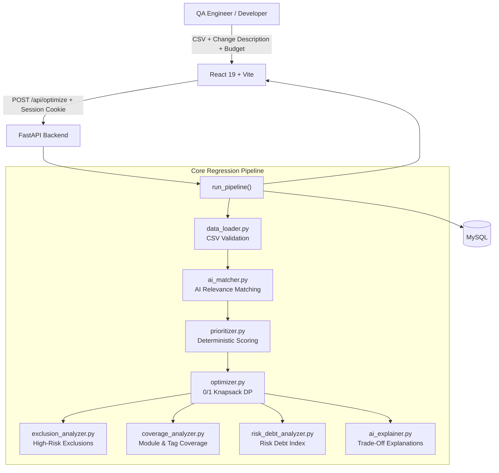
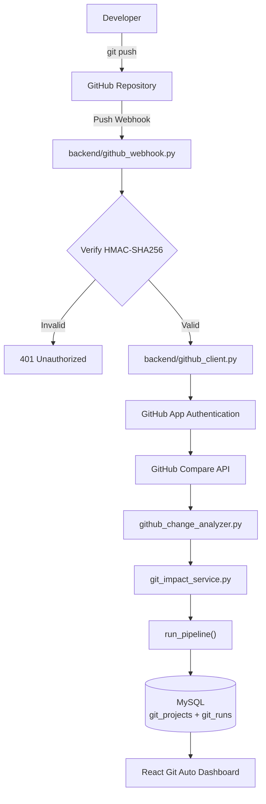
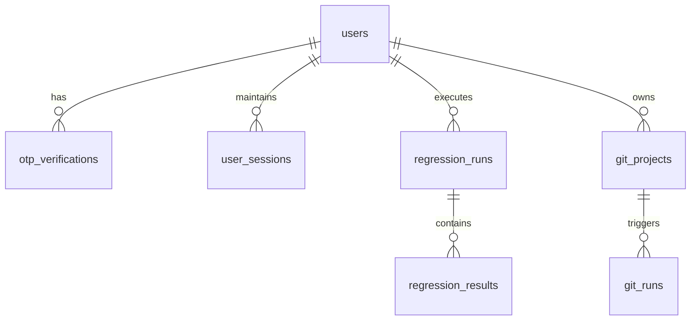

# Smart Regression Suite Optimizer (SRSO)

Smart Regression Suite Optimizer (SRSO) is an AI-assisted, deterministic decision-support system for selecting a regression-test subset under a fixed execution-time budget.

Given:

- a plain-English software change description,
- a regression-test catalog,
- a priority for each test,
- execution duration,
- historical failure information, and
- a fixed time budget,

SRSO ranks the tests, solves a 0/1 Knapsack optimization problem, and returns a regression suite that stays within the budget.

The system also reports exclusions, coverage gaps, deferred risk, and AI-generated explanations.

> **Core principle:** AI assists with relevance matching and explanations. The final suite is selected by deterministic scoring and optimization logic.

---

## Contents

- [Problem](#problem)
- [How SRSO Works](#how-srso-works)
- [AI Boundary](#ai-boundary)
- [Architecture](#architecture)
- [Technology Stack](#technology-stack)
- [Core Optimization Logic](#core-optimization-logic)
- [Git Auto](#git-auto)
- [Authentication and Security](#authentication-and-security)
- [Project Structure](#project-structure)
- [API](#api)
- [Test Catalog Format](#test-catalog-format)
- [Running Locally](#running-locally)
- [AI Provider Configuration](#ai-provider-configuration)
- [Testing](#testing)
- [Engineering Fixes](#engineering-fixes)
- [Known Limitations](#known-limitations)
- [Future Improvements](#future-improvements)

---

## Problem

Regression suites often contain more tests than can be executed inside a release window.

For example:

```text
Total regression suite: 160 minutes
Available release window: 30 minutes
```

A tester therefore needs to answer:

> Which tests provide the most value within the available 30 minutes?

SRSO models the problem using four signals:

1. **Relevance** to the software change.
2. **Business priority** of the test.
3. **Historical failure signal**.
4. **Execution duration** as the resource cost.

The result is not simply a list of the highest-scoring individual tests. The system finds the best combination of tests whose total execution time does not exceed the available budget.

---

## Objectives

SRSO is designed to:

- validate uploaded regression-test catalogs,
- understand a plain-English change description,
- calculate relevance for each test,
- combine relevance, business priority, and historical failure information,
- select a high-value subset within a strict time budget,
- identify high-risk tests that were excluded,
- calculate module and tag coverage,
- calculate a Risk Debt Index for deferred high-risk testing,
- explain selection trade-offs,
- maintain user-scoped optimization history,
- and automatically trigger the same pipeline from GitHub pushes through **Git Auto**.

---

## How SRSO Works

The standard manual flow is:


```mermaid
flowchart TD
    User["QA Engineer / Developer"] -->|"CSV + Change Description + Budget"| Frontend["React 19 + Vite"]
    Frontend -->|"POST /api/optimize + Session Cookie"| Backend["FastAPI Backend"]

    Backend --> Pipeline["run_pipeline()"]

    subgraph CorePipeline["Core Regression Pipeline"]
        Pipeline --> DataLoader["data_loader.py<br/>CSV Validation"]
        DataLoader --> Matcher["ai_matcher.py<br/>AI Relevance Matching"]
        Matcher --> Prioritizer["prioritizer.py<br/>Deterministic Scoring"]
        Prioritizer --> Optimizer["optimizer.py<br/>0/1 Knapsack DP"]

        Optimizer --> Exclusion["exclusion_analyzer.py<br/>High-Risk Exclusions"]
        Optimizer --> Coverage["coverage_analyzer.py<br/>Module & Tag Coverage"]
        Optimizer --> RiskDebt["risk_debt_analyzer.py<br/>Risk Debt Index"]
        Optimizer --> Explainer["ai_explainer.py<br/>Trade-Off Explanations"]
    end

    Pipeline --> DB[("MySQL")]
    Pipeline --> Frontend
```

### Request lifecycle

1. The user uploads the test catalog.
2. The user enters the software change description.
3. The user enters an execution-time budget.
4. FastAPI validates the authenticated request.
5. `data_loader.py` validates the test catalog.
6. `ai_matcher.py` produces relevance scores.
7. `prioritizer.py` calculates deterministic test values.
8. `optimizer.py` solves the 0/1 Knapsack problem.
9. Post-analysis calculates exclusions, coverage, risk debt, and recommendations.
10. `ai_explainer.py` generates natural-language explanations.
11. The backend persists the run and selected-test results.
12. React renders the result.

---

## AI Boundary

The AI boundary is intentionally narrow.

### AI is used for

**1. Relevance matching**

The change description is compared with test metadata:

- module,
- description,
- tags.

The AI produces a relevance score from 0 to 100.

**2. Explanation**

After the deterministic optimizer has selected the suite, the AI explains:

- why selected tests are relevant,
- why selected tests are valuable,
- why high-risk tests were excluded,
- and what budget trade-off occurred.

### AI does not perform

AI does not:

- select the final test suite,
- run the Knapsack optimization,
- override the time budget,
- change the deterministic scoring formula,
- calculate coverage,
- calculate Risk Debt,
- or modify the optimizer's result.

The architecture is therefore:

```text
Change Description
       |
       v
AI Relevance Matching
       |
       v
Deterministic Priority Scoring
       |
       v
0/1 Knapsack Optimization
       |
       v
Final Regression Suite
       |
       v
AI Explanation
```

This means the final optimization decision is deterministic **for a fixed set of relevance scores**. The AI relevance stage itself can vary when using a live model.

---

## Architecture

```text
                         ┌─────────────────────┐
                         │   React Frontend    │
                         │  Vite + Tailwind    │
                         └──────────┬──────────┘
                                    │ HTTP
                                    v
                         ┌─────────────────────┐
                         │   FastAPI Backend   │
                         │ Auth + API + GitHub │
                         └──────────┬──────────┘
                                    │
                    ┌───────────────┼────────────────┐
                    │               │                │
                    v               v                v
             Optimization       MySQL DB       GitHub Webhook
               Pipeline              │                │
                    │                 │                │
                    │                 │                v
                    │                 │         GitHub Compare API
                    │                 │                │
                    │                 │                v
                    │                 │        Change Analysis
                    │                 │                │
                    └─────────────────┴──────> Same Pipeline
```

### Major layers

#### Frontend

Responsible for:

- authentication screens,
- optimization form,
- result visualization,
- history,
- Git Auto configuration,
- Git Auto run inspection,
- and user interactions.

#### Backend

Responsible for:

- HTTP APIs,
- authentication,
- session handling,
- database persistence,
- GitHub App authentication,
- webhook verification,
- and orchestration of the optimization pipeline.

#### Core pipeline

Responsible for:

- loading and validating test data,
- AI relevance matching,
- deterministic prioritization,
- Knapsack optimization,
- exclusion analysis,
- coverage analysis,
- risk debt analysis,
- recommendations,
- and AI explanations.

#### Database

Stores:

- users,
- OTP verification records,
- sessions,
- regression runs,
- selected test results,
- Git projects,
- and Git Auto runs.

---

## Technology Stack

| Technology | Role |
|---|---|
| React 19 | Frontend UI |
| Vite | Frontend build tool |
| Tailwind CSS | Styling |
| React Router | Client-side routing |
| Axios | API communication |
| Lucide React | UI icons |
| Python 3.10+ | Backend/runtime |
| FastAPI | REST API |
| Uvicorn | ASGI server |
| Pandas | Test-catalog processing |
| NumPy | Data/array operations |
| SQLAlchemy 2 | ORM |
| MySQL | Persistence |
| PyMySQL | MySQL driver |
| Argon2 | Password and OTP hashing |
| aiosmtplib | Email OTP delivery |
| PyJWT | GitHub App JWT generation |
| Cryptography | GitHub App signing |
| OpenAI Python SDK | Optional AI provider |
| Google GenAI SDK | Gemini AI provider |
| Pytest | Automated testing |

---

## Core Optimization Logic

### 1. Test relevance

Each test receives a relevance score:

```text
0   = not relevant
100 = extremely relevant
```

The current AI layer supports:

- Gemini,
- OpenAI,
- deterministic mock matching for development/testing.

---

### 2. Business priority

The deterministic prioritizer maps business priority to a fixed score:

```python
PRIORITY_SCORES = {
    "High": 100,
    "Medium": 60,
    "Low": 30,
}
```

---

### 3. Historical failure score

Historical failures are normalized against the maximum failure count in the catalog:

```text
Historical Failure Score =
    (failure_count / max_failure_count) × 100
```

If every failure count is zero, the normalized failure score is zero.

---

### 4. Final deterministic score

The system combines:

```text
Final Priority Score =
    (Relevance × 0.50)
  + (Business Priority × 0.30)
  + (Historical Failure × 0.20)
```

Duration is intentionally **not** included in this score.

Duration represents the resource cost used by the optimization algorithm.

---

## 0/1 Knapsack Optimization

Regression-suite selection is modeled as a 0/1 Knapsack problem.

| Knapsack concept | SRSO equivalent |
|---|---|
| Item | Test case |
| Value | Deterministic priority score |
| Weight | Test duration |
| Capacity | Time budget |
| Decision | Selected or excluded |

The mathematical objective is:

```text
maximize Σ(priority_score_i × x_i)

subject to:

Σ(duration_i × x_i) <= time_budget

where:

x_i ∈ {0, 1}
```

The implementation uses dynamic programming.

For a test with:

```text
duration = 7 minutes
priority_score = 94
```

the optimizer treats:

```text
7 minutes = cost
94 = value
```

The algorithm searches for the highest total value that fits inside the budget.

### Why backwards iteration is used

The dynamic-programming loop processes capacities backwards so that each test can be selected at most once.

That preserves the 0/1 constraint.

### Complexity

For `N` tests and a budget of `B` minutes:

```text
Time:  O(N × B)
```

The current challenge scope uses a bounded test catalog and integer-minute durations.

---

## Post-Optimization Analysis

After the Knapsack step, SRSO calculates additional information.

### Exclusion analysis

A test is considered a high-risk exclusion when:

```text
priority == "High"
AND
relevance_score >= 50
AND
test was not selected
```

This makes budget-driven risk visible instead of hiding it.

### Coverage analysis

Coverage analysis reports:

- module coverage,
- fully covered modules,
- partially covered modules,
- uncovered modules,
- selected-test counts,
- tag distributions,
- and uncovered/high-risk tests.

This is **test-catalog coverage**, not source-code coverage.

### Risk Debt Index

Risk Debt measures the proportion of relevant high-risk testing value that was deferred because of the time budget.

It is an index, not a probability of production failure.

### Recommendations

The recommender summarizes:

- number of selected tests,
- total execution time,
- available budget,
- remaining time,
- and notable coverage/recommendation information.

---

## Git Auto

Git Auto automatically starts regression analysis from GitHub push events.


```mermaid
flowchart TD
    Developer["Developer"] -->|"git push"| GitHub["GitHub Repository"]
    GitHub -->|"Push Webhook"| Webhook["backend/github_webhook.py"]

    Webhook --> Signature{"Verify HMAC-SHA256"}
    Signature -->|"Invalid"| Reject["401 Unauthorized"]
    Signature -->|"Valid"| Client["backend/github_client.py"]

    Client --> AppAuth["GitHub App Authentication"]
    AppAuth --> Compare["GitHub Compare API"]

    Compare --> ChangeAnalyzer["github_change_analyzer.py"]
    ChangeAnalyzer --> Impact["git_impact_service.py"]
    Impact --> Pipeline["run_pipeline()"]

    Pipeline --> DB[("MySQL<br/>git_projects + git_runs")]
    DB --> UI["React Git Auto Dashboard"]
```

### Git Auto lifecycle

1. A developer pushes a change to GitHub.
2. GitHub sends a `push` webhook.
3. The backend verifies `X-Hub-Signature-256`.
4. The configured Git project is resolved.
5. The GitHub App creates a short-lived App JWT.
6. An installation access token is obtained.
7. The GitHub Compare API provides changed files and diffs.
8. `github_change_analyzer.py` interprets the change.
9. `git_impact_service.py` passes the synthesized change description into the existing pipeline.
10. The same optimizer runs.
11. A `GitRun` record is stored.
12. The frontend displays the run and its results.

### Important architectural point

Git Auto does **not** have a separate optimization engine.

Both entry points eventually use:

```text
run_pipeline()
```

That keeps manual and Git-triggered optimization behavior consistent.

---

## Authentication and Security

SRSO uses stateful database-backed sessions.

### Passwords

Passwords are hashed with Argon2 and are never stored as plaintext.

### Session cookies

Authentication uses an HTTP-only session cookie.

The raw session token is generated securely and the database stores its hash.

### Email OTP

Registration uses a six-digit email OTP with expiration and attempt limits.

### Ownership checks

History and Git Auto resources are scoped to the authenticated user.

A user must not be able to access another user's run by changing an ID in the URL.

### GitHub webhook verification

Incoming GitHub webhook payloads are verified using an HMAC-SHA256 signature.

### Secrets

Do not commit:

```text
.env
GitHub private keys
Gemini API keys
OpenAI API keys
SMTP credentials
Webhook secrets
```

Use `.gitignore` and local environment configuration for development.

---

## Project Structure

```text
Smart-Regression-Suite-Optimizer/
│
├── backend/
│   ├── api.py
│   ├── auth.py
│   ├── auth_routes.py
│   ├── database.py
│   ├── git_models.py
│   ├── git_routes.py
│   ├── github_client.py
│   ├── github_webhook.py
│   ├── history_routes.py
│   ├── migrate_run_numbers_and_cascades.py
│   ├── models.py
│   ├── otp_service.py
│   ├── schemas.py
│   └── session.py
│
├── data/
│   └── test_cases.csv
│
├── frontend/
│   ├── src/
│   │   ├── api.js
│   │   ├── App.jsx
│   │   ├── main.jsx
│   │   ├── components/
│   │   │   ├── auth/
│   │   │   ├── dashboard/
│   │   │   ├── git-auto/
│   │   │   └── layout/
│   │   ├── context/
│   │   │   └── AuthContext.jsx
│   │   ├── pages/
│   │   │   ├── Dashboard.jsx
│   │   │   ├── GitAuto.jsx
│   │   │   ├── History.jsx
│   │   │   ├── InputFormat.jsx
│   │   │   ├── Login.jsx
│   │   │   ├── Register.jsx
│   │   │   ├── Settings.jsx
│   │   │   └── VerifyOTP.jsx
│   │   └── utils/
│   │       └── date.js
│   ├── package.json
│   └── vite.config.js
│
├── src/
│   ├── ai_explainer.py
│   ├── ai_matcher.py
│   ├── ai_provider.py
│   ├── coverage_analyzer.py
│   ├── data_loader.py
│   ├── exclusion_analyzer.py
│   ├── git_impact_service.py
│   ├── github_change_analyzer.py
│   ├── optimizer.py
│   ├── pipeline.py
│   ├── prioritizer.py
│   ├── recommender.py
│   └── risk_debt_analyzer.py
│
├── tests/
│   ├── conftest.py
│   ├── test_ai_explainer.py
│   ├── test_ai_matcher.py
│   ├── test_api.py
│   ├── test_coverage_analyzer.py
│   ├── test_data_loader.py
│   ├── test_exclusion_analyzer.py
│   ├── test_git_auto_fixes.py
│   ├── test_git_impact_service.py
│   ├── test_github_change_analyzer.py
│   ├── test_optimizer.py
│   ├── test_pipeline.py
│   ├── test_prioritizer.py
│   ├── test_recommender.py
│   ├── test_risk_debt_analyzer.py
│   └── test_run_numbering_and_cascade.py
│
├── PLAN.md
├── REQUIREMENTS.md
└── requirements.txt
```

---

## Core Python Modules

| File | Responsibility |
|---|---|
| `data_loader.py` | Load and validate regression-test catalogs |
| `ai_provider.py` | Resolve Mock, OpenAI, or Gemini provider |
| `ai_matcher.py` | Change-to-test relevance matching |
| `prioritizer.py` | Deterministic multi-factor scoring |
| `optimizer.py` | 0/1 Knapsack dynamic programming |
| `exclusion_analyzer.py` | High-risk excluded tests |
| `coverage_analyzer.py` | Module and tag coverage |
| `risk_debt_analyzer.py` | Deferred high-risk testing index |
| `recommender.py` | Human-readable recommendation summary |
| `ai_explainer.py` | Natural-language trade-off explanations |
| `pipeline.py` | Orchestrates the full optimization flow |
| `github_change_analyzer.py` | Git change interpretation |
| `git_impact_service.py` | Connects Git changes to the optimization pipeline |

---

## Backend API

### General

| Method | Endpoint | Purpose |
|---|---|---|
| `GET` | `/` | Service status |
| `GET` | `/health` | Health check |
| `POST` | `/api/optimize` | Run the regression optimizer |

### Authentication

| Method | Endpoint | Purpose |
|---|---|---|
| `POST` | `/api/auth/register` | Register and send OTP |
| `POST` | `/api/auth/verify-otp` | Verify email OTP |
| `POST` | `/api/auth/resend-otp` | Resend OTP |
| `POST` | `/api/auth/login` | Create session |
| `GET` | `/api/auth/me` | Current authenticated user |
| `POST` | `/api/auth/logout` | End session |

### History

| Method | Endpoint | Purpose |
|---|---|---|
| `GET` | `/api/history` | List user's regression runs |
| `GET` | `/api/history/{run_id}` | Inspect one run |

### Git Auto

| Method | Endpoint | Purpose |
|---|---|---|
| `POST` | `/api/git-impact/setup` | Configure/update Git repository |
| `GET` | `/api/git-impact/project` | Get Git Auto configuration |
| `GET` | `/api/git-impact/runs` | List Git Auto runs |
| `GET` | `/api/git-impact/runs/{run_id}` | Get Git Auto run details |
| `DELETE` | `/api/git-impact/runs/{run_id}` | Delete an owned Git Auto run |

### GitHub

| Method | Endpoint | Purpose |
|---|---|---|
| `POST` | `/api/github/webhook` | Receive verified GitHub push events |

---

## Test Catalog Format

The default catalog uses these columns:

| Column | Type | Validation |
|---|---|---|
| `test_id` | String | Unique |
| `module` | String | Non-empty |
| `description` | String | Non-empty |
| `priority` | String | `High`, `Medium`, or `Low` |
| `duration` | Integer | Greater than zero |
| `tags` | String | Non-empty |
| `historical_failure_count` | Integer | Zero or greater |

Example:

```csv
test_id,module,description,priority,duration,tags,historical_failure_count
TC001,Authentication,Verify login with valid credentials,High,5,"authentication,login,success",4
TC002,Authentication,Verify login with invalid password,High,6,"authentication,login,failure",7
TC003,Authentication,Verify account lockout after failed attempts,High,8,"authentication,lockout,security",9
TC004,Authentication,Verify password reset using registered email,Medium,10,"authentication,password-reset,email",3
TC013,Payment,Verify successful UPI payment,High,8,"payment,upi,success",10
TC014,Payment,Verify failed UPI payment,High,7,"payment,upi,failure",12
TC015,Payment,Verify UPI payment timeout handling,High,15,"payment,upi,timeout",9
TC016,Payment,Verify card payment processing,High,10,"payment,card",5
TC017,Payment,Verify payment refund processing,High,14,"payment,refund",11
```

---

## Installation

### Prerequisites

- Python 3.10+
- Node.js 18+
- npm
- MySQL

### 1. Clone

```bash
git clone https://github.com/Rakshithh-K/Smart-Regression-Suite-Optimizer.git
cd Smart-Regression-Suite-Optimizer
```

### 2. Create Python environment

Windows PowerShell:

```powershell
python -m venv .venv
.\.venv\Scripts\Activate.ps1
```

Linux/macOS:

```bash
python -m venv .venv
source .venv/bin/activate
```

### 3. Install backend dependencies

```bash
pip install -r requirements.txt
```

### 4. Install frontend dependencies

```bash
cd frontend
npm install
cd ..
```

---

## AI Provider Configuration

Create a `.env` file in the repository root.

### Mock mode

```env
AI_PROVIDER=mock
```

This is deterministic and does not require an external AI API.

### Gemini mode

```env
AI_PROVIDER=gemini
GEMINI_API_KEY=your_gemini_api_key
GEMINI_MODEL=gemini-3.8-flash
GEMINI_FALLBACK_MODELS=gemini-3.6-flash
```

### OpenAI mode

```env
AI_PROVIDER=openai
OPENAI_API_KEY=your_openai_api_key
```

Other backend variables include database, SMTP, and GitHub App configuration.

Never commit your real `.env` file.

---

## Running Locally

### Backend

From the repository root:

```bash
uvicorn backend.api:app --reload --host 127.0.0.1 --port 8000
```

API documentation:

```text
http://127.0.0.1:8000/docs
```

### Frontend

In another terminal:

```bash
cd frontend
npm run dev
```

Open:

```text
http://localhost:5173
```

---

## Example Optimization Request

The backend accepts the uploaded catalog, change description, and budget as multipart form data.

Example:

```bash
curl -X POST "http://127.0.0.1:8000/api/optimize" \
  -b "srso_session=<YOUR_SESSION_TOKEN>" \
  -F "file=@data/test_cases.csv" \
  -F "change_description=Updated UPI payment gateway and checkout timeout handling" \
  -F "time_budget=30"
```

---

## Testing

The project currently has:

```text
40 automated tests
40 passed
```

Run the complete suite with:

```bash
python -m pytest -v
```

The test suite covers:

- data validation,
- AI matcher behavior,
- AI explanation structure,
- prioritization,
- Knapsack optimization,
- coverage analysis,
- exclusion analysis,
- risk debt,
- recommendations,
- FastAPI APIs,
- Git change analysis,
- Git impact orchestration,
- Git Auto ownership and deletion rules,
- run-number isolation,
- and cascade behavior.

`tests/conftest.py` keeps the automated test suite independent of live AI-service availability by using the deterministic mock provider.

---

## Error Handling

Typical validation and authorization responses include:

| Scenario | Status |
|---|---:|
| Missing required CSV columns | `400` |
| Invalid priority | `400` |
| Non-positive duration | `400` |
| Invalid time budget | `400` |
| Unauthenticated request | `401` |
| Invalid GitHub webhook signature | `401` |
| Unowned Git Auto run | `404` |
| Unknown Git Auto repository | `404` |

A temporary AI-provider failure should be handled by the configured AI-provider logic and fallback configuration rather than changing the deterministic optimizer itself.

---

## Engineering Fixes

Several important bugs were identified and fixed during development.

### Git Auto run lookup

A run belonging to a user's second configured repository could previously return `404`.

The fix validates runs against all Git projects owned by the authenticated user instead of checking only the first project.

### Git Auto project duplication

Re-submitting the same repository configuration previously created duplicate `GitProject` records.

The setup flow now updates an existing `(user, owner, repository)` configuration instead of creating duplicates.

### Legacy/failed Git Auto results

Git runs with missing result JSON previously caused an error while opening the details page.

The backend and frontend now handle incomplete/failed run records safely.

### Git Auto run deletion

Run deletion is ownership-scoped so users can delete their own run without affecting other users' runs or the parent project.

### Timestamp display

Backend timestamps are stored as UTC. The frontend normalizes backend timestamps and displays them in the user's local timezone.

---

## Database Design

Major entities:


```mermaid
erDiagram
    users ||--o{ otp_verifications : has
    users ||--o{ user_sessions : maintains
    users ||--o{ regression_runs : executes
    users ||--o{ git_projects : owns
    regression_runs ||--o{ regression_results : contains
    git_projects ||--o{ git_runs : triggers
```

### Main tables

- `users`
- `otp_verifications`
- `user_sessions`
- `regression_runs`
- `regression_results`
- `git_projects`
- `git_runs`

Foreign-key relationships use cascading behavior where configured so dependent records are not left orphaned.

---

## End-to-End Example

Suppose the change description is:

```text
Fix UPI payment failure handling
```

and the execution budget is:

```text
30 minutes
```

### Step 1: Relevance

Payment-related tests receive higher relevance because their metadata matches the change.

### Step 2: Deterministic scoring

Each test receives a final priority score:

```text
0.50 × relevance
+ 0.30 × business priority
+ 0.20 × historical failure score
```

### Step 3: Optimization

The Knapsack optimizer chooses the highest-value combination whose total duration is at most 30 minutes.

### Step 4: Risk

High-priority relevant tests that did not fit are listed as high-risk exclusions.

### Step 5: Coverage

The system identifies affected modules and tags that remain uncovered or only partially covered.

### Step 6: Explanation

The AI provider explains the trade-offs using the deterministic result.

---

## Why the Design Uses Deterministic Optimization

A live AI model is useful for language understanding, but it is not the right component to enforce a hard execution budget.

For example:

```text
AI:
"These five tests look important."

Deterministic optimizer:
"Those five tests require 42 minutes.
The budget is 30.
Here is the mathematically best feasible subset."
```

This gives SRSO a clear separation between:

- semantic understanding,
- mathematical decision-making,
- and human-readable explanation.

---

## Current Status

The local project currently includes:

- manual regression optimization,
- AI relevance matching,
- deterministic prioritization,
- 0/1 Knapsack optimization,
- coverage analysis,
- high-risk exclusion analysis,
- Risk Debt Index,
- AI explanations,
- authentication and email OTP,
- user-scoped history,
- Git Auto GitHub integration,
- Git Auto run inspection and deletion,
- and 40 automated tests passing.

---

## Known Limitations

The current implementation intentionally has a bounded scope.

- It does not execute the selected tests itself.
- It does not model test dependencies or required execution ordering.
- The default challenge catalog is bounded around the original 20-test requirement.
- Live AI services can experience rate limits or temporary service availability issues.
- Production hardening such as HTTPS enforcement, API rate limiting, and CSRF protection should be completed before treating the system as a production service.
- Git Auto webhook processing is currently synchronous.
- Very large catalogs may require further optimization and batching strategies.

---

## Future Improvements

Potential next steps include:

- semantic embeddings for richer test relevance matching,
- support for larger test catalogs,
- test dependency graphs,
- asynchronous GitHub webhook processing,
- CI/CD test execution integration,
- stronger production security controls,
- richer audit trails,
- model/provider health monitoring,
- and historical learning from actual test outcomes.

---

## Development Philosophy

SRSO was designed around three principles:

### 1. Make the decision reproducible

The final suite is produced by explicit scoring and optimization logic rather than an opaque model decision.

### 2. Make deferred risk visible

Tests that do not fit the budget are not silently discarded. High-risk exclusions, coverage gaps, and Risk Debt are surfaced.

### 3. Use AI where it adds value

AI handles language understanding and explanation. Deterministic code handles constraints and optimization.

---
 